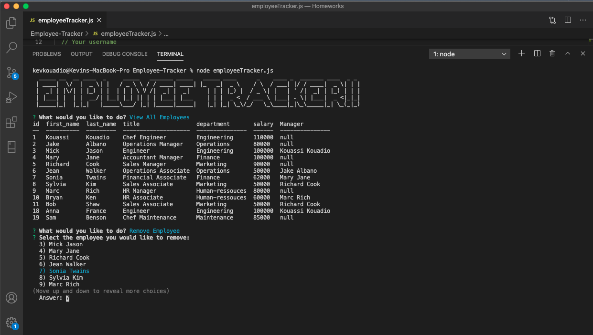
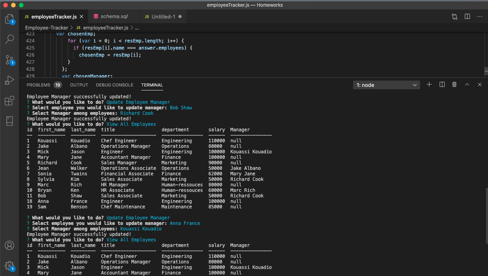

# MySQL Homework: Employee Tracker

## Description
This app is a Content Management Systems that make it easy for non-developers to view and interact with information stored in databases using node, inquirer, MySQL, and console.table. 
## Table of contents
* [Description](#Description)
* [Installation](#Installation)
* [Usage](#Usage)
* [License](#License)
* [Contributing](#Contributing)
* [Screenshot](#Screenshot)
* [Questions](#Questions)
## Installation
The app uses node, inquirer, console.table and MySQL. So the user need to intall the all dependancies by running ```npm install```.
## Usage
After installing all the dependencies, run ```node employeeTracker.js``` in your termial command. Then use the keyboard arrows to select and respond to all the prompt questions. 
The user can view, add, update and remove employees information.
## Licence
This app is under the MIT License.
## Contributing
If anyone want to improve the app, feel free to contact me.
## Screenshot
[Click here to see the demo video](https://youtu.be/GUF6WyS3L1Y)



## Questions
Contact me: kevkouadio@gmail.com

My Github: http://github.com/kevkouadio